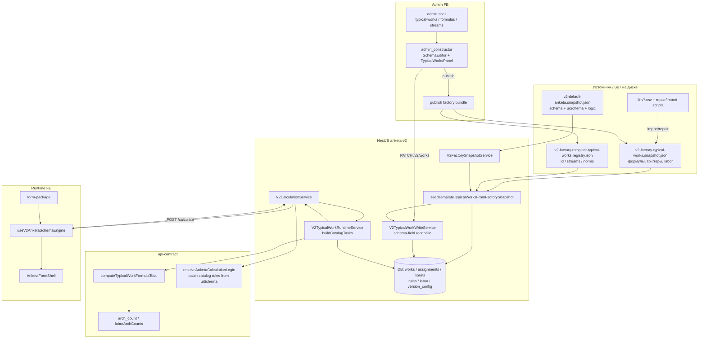
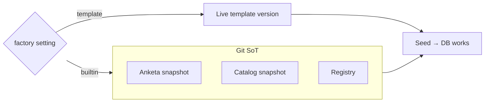
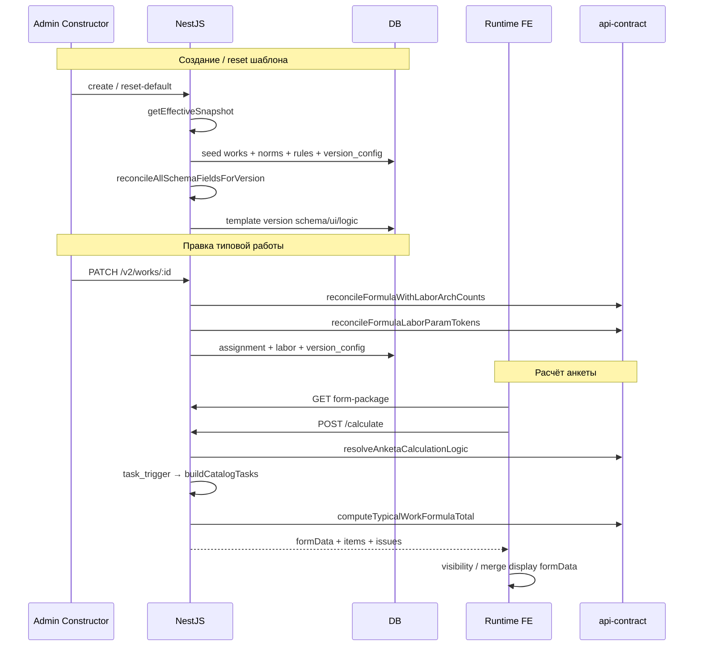
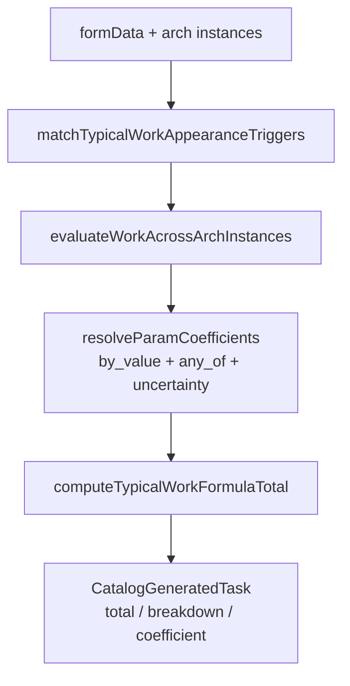
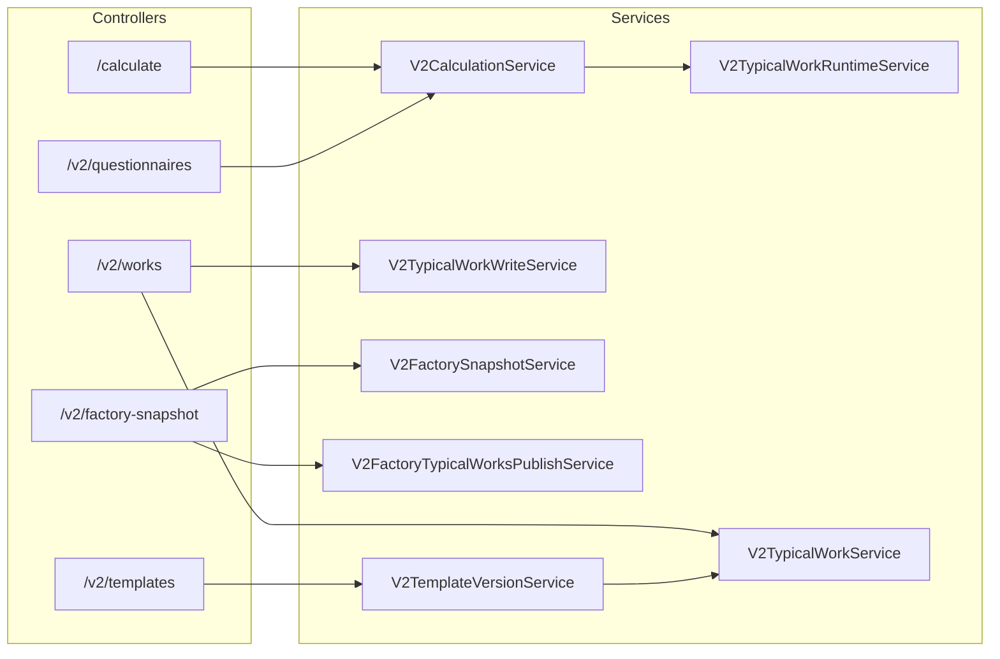
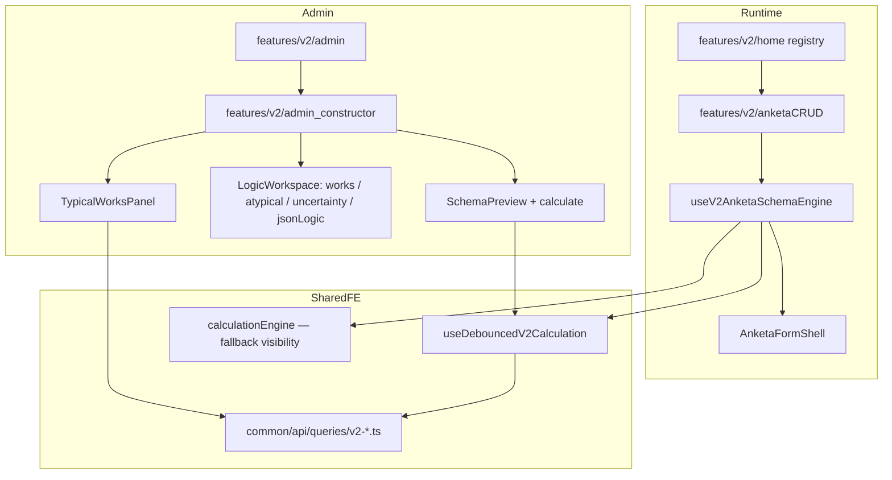
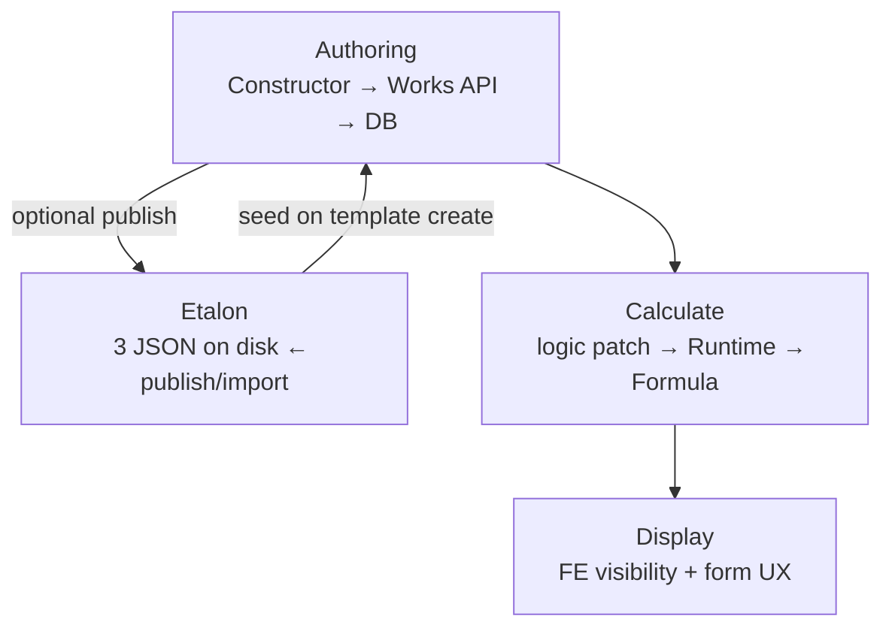

# V2: текущий срез архитектуры

Карта движка, реконсайлера, формул, factory-snapshot, фронта и бэка.  
Цель — понять **источники истины**, **дубли** и **что можно убрать**.

---

## 1. Картина целиком

**Коротко:** деньги/строки типовых работ считает **бэкенд**. Фронт авторствует схему и карточки работ, показывает форму и visibility. Factory JSON на диске — git-эталон; после seed живёт DB.

---

## 2. Три слоя factory (не один snapshot)

| Слой | Файл | Что хранит | Кто читает |
|------|------|------------|------------|
| Anketa | `v2-default-anketa.snapshot.json` | `jsonSchema`, `uiSchema`, `logic`, словари | создание/reset шаблона |
| Catalog | `v2-factory-typical-works.snapshot.json` | правила, labor, `formulaText`, laborArchCounts, methodology | seed + import/publish |
| Registry | `…registry.json` | id, имя, arch type, streams, `normsByStream` | seed (тонкий индекс) |

Опционально DB override: `V2FactorySnapshotSettingEntity` (`builtin` | `template`) через `V2FactorySnapshotService.getEffectiveSnapshot()`.

**Дрейф:** registry ↔ catalog ↔ `uiSchema.boundWorkIds` могут разъехаться. Канонический путь синхронизации — `publish:factory-typical-works` (оба JSON), не тонкий `sync:factory-template-works-registry`.

---

## 3. Lifecycle: от эталона до расчёта

---

## 4. Два разных «реконсайлера»

Имя «reconcile» в коде означает **разные** процессы.

### A. Schema-field reconciler (write path)

**Где:** `V2TypicalWorkWriteService` + `v2-typical-work-schema-sync.util.ts`  
**Когда:** save работы, `POST /v2/works/schema-field-sync`, после seed.  
**Что делает:** перемапливает triggers / labor / formula tokens при переименовании/переносе полей схемы; синкает `laborArchCounts` ↔ токены `архкоэф(...)`.

### B. Runtime materializer (не называется reconcile)

**Где:** `V2TypicalWorkRuntimeService.buildCatalogTasks`  
**Когда:** каждый `calculate` / preview.  
**Что делает:** assignments ∩ works ∩ stream scope → triggers → per-instance eval → `CatalogGeneratedTask[]`.

```mermaid
flowchart TD
  subgraph WritePath["Write / authoring"]
    Patch[PATCH work / schema-field-sync]
    RecA[reconcileTypicalWorkCardWithSchemaField]
    RecF[reconcileFormulaWithLaborArchCounts]
    RecT[reconcileFormulaLaborParamTokens]
    Patch --> RecA --> RecF --> RecT --> DB[(version_config)]
  end

  subgraph RuntimePath["Calculate path"]
    Calc[V2CalculationService]
    Trig[task_trigger applyGeneratedRows]
    Build[buildCatalogTasks]
    Eval[evaluateWorkInstance]
    Total[computeTypicalWorkFormulaTotal]
    Calc --> Trig --> Build --> Eval --> Total
    Total --> Rows[generated rows in formData]
  end
```

---

## 5. Формульный движок (api-contract)

### 5.1 Три представления одной формулы

| Представление | Где лежит | Роль |
|---------------|-----------|------|
| **Tokens / formulaText** | `version_config.formula`, `.formulaText` | **основной SoT для арифметики** |
| **Terms** | terms DTO (additive / multiplicative / transitive) | нужен для **transitive** `work_ref` |
| **calculationLogic** | JsonLogic v1 в version_config | legacy / backfill; не должен перекрывать скобки |

Приоритет `computeTypicalWorkFormulaTotal`:

1. Если в terms есть `transitive` → `evaluateTermsFormula`
2. Иначе tokens / `formulaText` → `previewTypicalWorkCalculation`
3. Иначе stored `calculationLogic`
4. Иначе fallback terms

### 5.2 Токены

- `norm` — N  
- `param_coeff` / `param_anyof` — labor coefficients  
- `arch_count_coeff` — шкала count→K по kind (`model`, `sourceSystem`, …)  
- `work_ref` — ссылка на другую работу  
- `number`, `operator`, `paren_*`

Параллельно: `laborArchCounts` на assignment (структурированная шкала) синхронизируется с текстом `архкоэф(Модели; 1=1; …)`.

### 5.3 Runtime eval одной строки

Ключевые файлы:

| Файл | Назначение |
|------|------------|
| `v2-work-formula.util.ts` | parse text↔tokens, eval, reconcile labor tokens |
| `v2-work-terms-formula.util.ts` | terms model + transitive |
| `v2-typical-work-jsonlogic.util.ts` | compile, preview, **computeTypicalWorkFormulaTotal** |
| `v2-work-arch-count-coeff.util.ts` | count arch instances, step lookup, trigger match |
| `v2-labor-arch-count.util.ts` | laborArchCounts ↔ formula sync, default scales |
| `v2-csv-formula-import.util.ts` | offline CSV → catalog patches |
| `v2-trigger-formula.util.ts` | trigger formula tokens |

---

## 6. Backend module map

**DB сущности (ядро типовых работ):**

- `TypicalWork` — identity  
- `Assignment` — stream + trigger + laborArchCounts  
- `Norm` / `Rule` / `LaborCoefficient` / `LaborParam`  
- `VersionConfig` — formula / formulaText / rounding / calculationLogic  

---

## 7. Frontend map

### Кто что считает

| Concern | Где |
|---------|-----|
| Генерация строк типовых работ (`worksCatalog`) | **только backend** (`buildCatalogTasks`) |
| Итоги / breakdown / preview одной работы | **backend** (`/calculate`, `/works/:id/preview`) |
| Visibility / required / UI hints | **frontend** (`derivePreviewSchemas`) |
| FE `evaluateTaskTriggers` / local computed | **fallback**, пока нет liveData с бэка |
| Stream/role masking оценок | FE policy + runtime-settings |
| Uncertainty → atypical K | FE + api-contract helpers |

### Admin vs Runtime

- Preview конструктора и runtime анкеты делят `useDebouncedV2Calculation` + контракт `AnketaFormShell`.  
- Два UI типовых работ: полный редактор в конструкторе и browse/detail в `/admin/typical-works`.  
- Playground `/playground/v2/...` — параллельный вход в тот же конструктор.

---

## 8. Import / publish tooling

| Путь | Скрипт | Статус |
|------|--------|--------|
| Канон из админки | `publish:factory-typical-works` | **основной** → registry + catalog |
| Sync анкеты | `sync:factory-snapshot` | anketa JSON |
| Thin registry | `sync:factory-template-works-registry` | **legacy**, недостаточен один |
| CSV methodology | `import:csv-formulas` | dry-run по умолчанию |
| Model stream CSV | `import:model-stream` | 10 работ + bindings |
| ПиРМ | `import:pirm` | отдельный стрим |
| Python repair-* | `repair-mdlctl/model-stream/sources/pirm-from-csv.py` | ручной repair, дублирует стиль TS-import |
| Doc-catalog | `seedFromDocCatalog` / `v2-doc-catalog.ts` | **deprecated aliases** |

CSV **не** читается в runtime — только offline → snapshot → seed.

---

## 9. Источники истины (сводка)

| Concern | SoT | Тень / дубль |
|---------|-----|--------------|
| Схема анкеты (shipped) | anketa snapshot JSON | DB template при `source=template` |
| Формулы/триггеры (shipped) | catalog snapshot JSON | DB после seed; админ правит до publish |
| Индекс id/norms | registry JSON | должен совпадать с catalog + boundWorkIds |
| Live estimates | DB version_config + assignments | catalog JSON только при seed/import |
| Catalog logic rules | патч из uiSchema на calculate | persisted logic может быть stale |
| Methodology CSV | offline inputs | не runtime |

---

## 10. Лишнее / кандидаты на выпил или упрощение

Оценка «можно убрать» — по текущему коду; перед удалением нужен короткий audit callers.

### Высокий приоритет (низкий риск / явный dead)

| Что | Почему |
|-----|--------|
| `v2-doc-catalog` / `seedFromDocCatalog` aliases | переименовано в factory snapshot |
| Пустые `V2_MODEL_STREAM_ALWAYS_SHOWN/ACTIVE` | deprecated hooks всё ещё в runtime |
| Thin `sync:factory-template-works-registry` как «основной» путь | superseded publish bundle |
| `features/v2/mock/dashboardMock` | не в основных flow |
| Playground demo uncertainty / static RJSF examples | не production path |

### Средний приоритет (упростить модель)

| Что | Почему | Осторожность |
|-----|--------|--------------|
| `calculationLogic` как третье хранилище формулы | tokens/text уже SoT | нужен backfill + transitive через terms |
| FE `calculationEngine.applyGeneratedRows` для worksCatalog | no-op / fallback рядом с обязательным BE | оставить thin visibility-only или выкинуть catalog branch |
| Два admin UI типовых работ | overlapping | оставить один editable surface |
| Три preview shell (dock / template preview / runtime) | один engine contract | можно свести оболочки |
| Python `repair-*-from-csv` + TS import | два стиля offline patch | свести к TS import/publish |

### Не трогать без продуктового решения

| Что | Почему |
|-----|--------|
| Registry **и** catalog | разные роли; publish обязан писать оба |
| Builtin JSON **и** DB etalon | разные режимы factory setting |
| Model umbrella + child streams | продуктовая модель назначений |
| Terms + tokens | transitive требует terms |
| mdlctl flat scale vs model-stream 0.75 scale | разные шкалы, не путать |

---

## 11. Рекомендуемая ментальная модель

1. **Авторство** живёт в DB (после seed).  
2. **Эталон для новых шаблонов / reset** — три JSON (+ optional DB factory setting).  
3. **Расчёт** всегда через backend Runtime + api-contract formula.  
4. **Фронт** — UX, visibility, authoring; не SoT для денег типовых работ.

---

## 12. Ключевые пути файлов

### Backend
- `apps/nestjs-server/src/modules/anketa-v2/services/v2-calculation.service.ts`
- `…/v2-typical-work-runtime.service.ts`
- `…/v2-typical-work-write.service.ts`
- `…/v2-typical-work.service.ts` (seed)
- `…/v2-factory-snapshot.service.ts`
- `…/constants/v2-factory-typical-works.snapshot.json`
- `…/constants/v2-factory-template-typical-works.registry.json`
- `…/constants/v2-default-anketa.snapshot.json`

### Shared
- `packages/api-contract/src/v2-typical-work-jsonlogic.util.ts`
- `…/v2-work-formula.util.ts`
- `…/v2-labor-arch-count.util.ts`
- `…/v2-work-arch-count-coeff.util.ts`
- `…/v2-default-typical-works-logic.util.ts`

### Frontend
- `apps/react-client/src/features/v2/admin_constructor/`
- `…/anketaCRUD/` + `useV2AnketaSchemaEngine`
- `…/admin_constructor/utils/calculationEngine.ts`
- `apps/react-client/src/common/api/queries/v2-*.ts`

### Scripts
- `apps/nestjs-server/scripts/publish-factory-typical-works-bundle.ts`
- `…/import-model-stream-to-factory.ts`
- `…/import-csv-formulas-to-factory.ts`
- `…/repair-*-from-csv.py`
