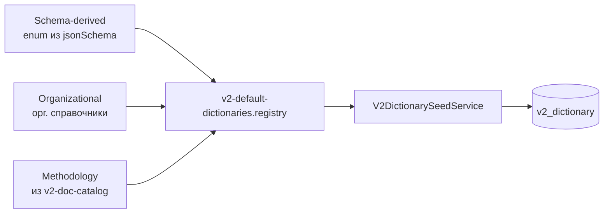

# Smart Anketa v2 — сводка по работе приложения

Документ описывает, как устроен монорепозиторий **smart_anketa_ui**: потоки данных между фронтом и бэком, роль эталонного снепшота, жизненный цикл схемы, конструктор, расчёт и интеграция с хост-платформой (SUMA/SURM через MFE).

> Актуально на состояние репозитория после синхронизации параметров из `llm/v2_new_docs/Параметры 15.06.csv`.

---

## 1. Общая архитектура

```mermaid
flowchart TB
  subgraph sources [Источники истины]
    CSV[CSV методолога<br/>работы / справочники / параметры]
    SNAP[v2-default-anketa.snapshot.json]
    LOGIC[v2-default-logic.ts]
  end

  subgraph build [Сборка / скрипты]
    DOC[build-v2-doc-catalog]
    PARAMS[sync-v2-params-from-csv]
    ARCH[sync-arch-presets]
  end

  subgraph backend [NestJS API]
    SEED[V2DictionarySeedService]
    TMPL[V2TemplateVersionService]
    CALC[V2CalculationService]
    Q[V2QuestionnaireService]
    DB[(PostgreSQL v2_*)]
  end

  subgraph frontend [React Client]
    CONS[Конструктор схем]
    ANK[Анкета CRUD]
    MFE[MFE remote smartAnketa]
  end

  subgraph contract [@smart-anketa/api-contract]
    TYPES[DTO / types / utils]
  end

  CSV --> DOC
  CSV --> PARAMS
  PARAMS --> SNAP
  SNAP --> ARCH
  DOC --> LOGIC
  SNAP --> SEED
  LOGIC --> TMPL
  SEED --> DB
  TMPL --> DB
  Q --> DB
  CALC --> TMPL

  contract --> backend
  contract --> frontend
  backend -->|REST /v2/*| frontend
  MFE --> ANK
  MFE --> CONS
```


### Монорепозиторий


| Путь                     | Назначение                                                             |
| ------------------------ | ---------------------------------------------------------------------- |
| `apps/react-client`      | UI: анкета, реестр, админка, конструктор (RJSF + ReactFlow + dockview) |
| `apps/nestjs-server`     | API: шаблоны, версии, справочники, расчёт, экземпляры анкет            |
| `packages/api-contract`  | Общие типы, DTO, утилиты layout/workflow/logic — единый контракт       |
| `packages/json-logic-ts` | Движок JsonLogic для правил расчёта                                    |
| `llm/v2_new_docs/`       | Авторитетные CSV/MD методолога                                         |
| `scripts/`               | Синхронизация снепшота, пресетов, миграции enum→boolean                |


**Запуск локально:** `npm run dev:fullstack` или `npm run dev:fullstack:god` (без Keycloak, `NO_ROLES=true`).

---

## 2. Backend (NestJS)

### 2.1 Модули


| Модуль            | Роль                                                      |
| ----------------- | --------------------------------------------------------- |
| `anketa-v2`       | Основной v2: шаблоны, версии, справочники, расчёт, анкеты |
| `calculation`     | Legacy v1 расчёты (`calculation` table)                   |
| `questionnaire`   | Legacy v1 справочники коэффициентов                       |
| `docs`            | Документация/диаграммы                                    |
| `shared/keycloak` | JWT, GodModeGuard для dev                                 |
| `shared/database` | TypeORM + Postgres, auto-migrations                       |


### 2.2 REST API (v2)


| Префикс                  | Контроллер                    | Сущности                                    |
| ------------------------ | ----------------------------- | ------------------------------------------- |
| `GET/POST /v2/templates` | `V2TemplateController`        | Шаблон (логическая «схема анкеты»)          |
| `.../versions`           | `V2TemplateVersionController` | Версии: jsonSchema, uiSchema, logic, status |
| `.../calculate`          | `V2CalculationController`     | Серверный расчёт по formData                |
| `/v2/dictionaries`       | `V2DictionaryController`      | Методологические и schema-enum справочники  |
| `/v2/questionnaires`     | `V2QuestionnaireController`   | Экземпляры заполненных анкет                |


### 2.3 База данных (PostgreSQL)

Основные таблицы v2 (миграции в `apps/nestjs-server/src/migrations/`):


| Таблица                                | Содержимое                                                                  |
| -------------------------------------- | --------------------------------------------------------------------------- |
| `v2_template`                          | Шаблон: `code`, `name`, `**currentVersionId`** (глобально активная версия)  |
| `v2_template_version`                  | Версия: `jsonSchema`, `uiSchema`, `logic`, `dictionariesSnapshot`, `status` |
| `v2_dictionary` / `v2_dictionary_item` | Справочники и элементы (`code` ≤100 символов, `label` ≤500)                 |
| `v2_questionnaire`                     | Анкета: `formData`, `boundTemplateVersionId`, workflow, коэффициент         |
| `v2_template_audit`                    | Журнал действий над шаблоном/версией                                        |


**Важно:** в системе может быть **только один** «текущий» опубликованный шаблон (`currentVersionId` глобально).

### 2.4 Авторизация

- Production: Keycloak (`KEYCLOAK_URL`, realm `cym`, client `frontend`), bearer JWT на API.
- Dev: `NO_ROLES=true` → `GodModeGuard` пропускает все запросы.
- **Нет** HTTP-вызовов в SUMA/SURM с бэка — только Postgres + Keycloak (+ опционально TSLG-логи).

---

## 3. Эталонный снепшот — центральный артеfact

### 3.1 Файлы


| Файл                                        | Роль                                                                                |
| ------------------------------------------- | ----------------------------------------------------------------------------------- |
| `constants/v2-default-anketa.snapshot.json` | **Источник структуры** анкеты: `jsonSchema` + `uiSchema`                            |
| `constants/v2-default-template-snapshot.ts` | Загрузчик: читает JSON, обогащает, собирает `V2_DEFAULT_TEMPLATE_SNAPSHOT`          |
| `constants/v2-default-logic.ts`             | Заводская **логика** (`V2_DEFAULT_LOGIC_GRAPH`): visibility, computed, task_trigger |
| `constants/v2-source-works.builder.ts`      | Типовые работы для task_trigger (из doc catalog)                                    |


### 3.2 Что происходит при загрузке снепшота (`v2-default-template-snapshot.ts`)

```
v2-default-anketa.snapshot.json
        │
        ├─► strip $schema (draft-07)
        ├─► buildDictionaryBindingsFromSchema(jsonSchema)
        ├─► applyDictionaryBindingsToUiSchema(uiSchema)   // ui:options.dictionaryCode
        ├─► enrichAnketaLayoutUiSchema(uiSchema)            // layout, sectionRole, grid
        └─► + V2_DEFAULT_LOGIC_GRAPH
                │
                ▼
        V2_DEFAULT_TEMPLATE_SNAPSHOT
        { jsonSchema, uiSchema, logic, dictionariesSnapshot, releaseNotes }
```

### 3.3 Структура jsonSchema (логические разделы)


| Корневой ключ                                | UI-раздел                | Содержимое                                                       |
| -------------------------------------------- | ------------------------ | ---------------------------------------------------------------- |
| `workflow`                                   | (системный)              | Статусы заполнения разделов                                      |
| `meta`                                       | скрытый                  | id, name, version, status                                        |
| `generalInfo`                                | Общая информация         | Мета + параметры + `modelService`                                |
| `uncertaintyCalculation`                     | Расчёт неопределённости  | Сроки, стоимость, группа рисков                                  |
| `detailInfo`                                 | Детальная информация     | sourceSystems[], dataProcess, dataMart, model, типовые/нетиповые |
| `streamDataSources`                          | Стрим «Источники данных» | localParams, типовые/нетиповые работы                            |
| `streamModelControl`                         | Стрим «Контроль моделей» | localParams, нетиповые                                           |
| `streamDigitalAgents`, `streamStreamingData` | Другие стримы            | localParams (заготовки)                                          |
| `summary`                                    | Итог                     | readOnly поля расчёта                                            |


**Арх. компоненты** (пресеты в `@smart-anketa/api-contract`):

- `modelService`, `sourceSystem` (items массива), `dataProcess`, `dataMart`, `model`

### 3.4 Поддержка снепшота скриптами


| Скрипт                                   | Команда                                 | Действие                                       |
| ---------------------------------------- | --------------------------------------- | ---------------------------------------------- |
| `sync-v2-params-from-csv.mjs`            | `npm run sync:v2-params-from-csv`       | Поля arch/localParams из `Параметры 15.06.csv` |
| `sync-v2-arch-component-presets.mjs`     | `npm run sync:arch-presets`             | Пресеты arch → `api-contract`                  |
| `migrate-v2-binary-enums-to-boolean.mjs` | `npm run migrate:v2-binary-booleans`    | Да/Нет → boolean                               |
| `strip-boolean-schema-defaults.mjs`      | `npm run strip:boolean-schema-defaults` | Убрать default у checkbox                      |
| `build-v2-doc-catalog.ts`                | `npm run build:doc-catalog` (nestjs)    | CSV работ/справочников → JSON каталог          |
| `sync-v2-anketa-snapshot-layout.ts`      | `npm run sync:anketa-snapshot-layout`   | Layout ui:options в снепшот                    |


**Порядок после правок методолога:**

```bash
npm run sync:v2-params-from-csv
npm run sync:arch-presets
npm run build --workspace=@smart-anketa/api-contract
# при изменении CSV работ/справочников:
cd apps/nestjs-server && npm run build:doc-catalog
```

---

## 4. Справочники (dictionaries)

### 4.1 Три слоя




1. **Schema-derived** — для каждого поля с `enum` в jsonSchema создаётся справочник с кодом вида `v2.generalInfo.complexity`. Элементы: короткий `code` + полный `label` (enum-текст).
2. **Organizational** — `v2-default-organizational-dictionaries.ts`.
3. **Methodology** — из `работы.csv` + `справочники_сфера_документы.csv` через `build-v2-doc-catalog`.

### 4.2 Seed при старте API

`V2DictionarySeedService.onModuleInit`:

1. Удаляет **superseded** enum-дубли (если методологический справочник заменил schema-enum и код не используется в версиях).
2. Создаёт отсутствующие заводские справочники + items.
3. Досеивает items, если справочник есть, но items = 0 (после сбоя транзакции).
4. Синхронизирует metadata (name, category, description).

### 4.3 Связка schema ↔ UI ↔ API

- В **uiSchema**: `ui:options.dictionaryCode = "v2...."`.
- На фронте: `useV2DictionaryEnumsMaps` → `GET /v2/dictionaries/json/:code`.
- `mergeDictionaryEnumsIntoPreviewSchema` подставляет актуальные enum из БД в preview-схему.
- **В formData хранится `label`** (полный текст enum), не короткий DB-code.

---

## 5. Жизненный цикл шаблона и версий

### 5.1 Статусы версии

`draft` → `published` → `archived`

### 5.2 Ключевые операции


| Операция            | Endpoint                        | Поведение                                          |
| ------------------- | ------------------------------- | -------------------------------------------------- |
| Создать шаблон      | `POST /v2/templates`            | Новая запись `v2_template`                         |
| Черновик из эталона | `POST .../from-default`         | Копия `V2_DEFAULT_TEMPLATE_SNAPSHOT`, status=draft |
| Сброс к эталону     | `POST .../reset-default`        | Draft из эталона → publish → второй draft-клон     |
| Сохранить черновик  | `PUT .../versions/:id`          | Только если status=draft                           |
| Опубликовать        | `POST .../versions/:id/publish` | status=published, `setGlobalCurrentVersion`        |
| Активировать        | `POST .../activate-as-current`  | Сделать текущей системной версией                  |
| Откат               | `POST .../rollback`             | Новый draft с копией старой версии                 |


### 5.3 Поток «новая схема в админке»

```
AdminV2SchemasPage → V2SchemaCreateDialog
    → POST /v2/templates
    → POST .../from-default  (или пустой draft)
    → navigate /admin/templates/:id/edit
    → V2TemplateSchemaEditor (редактирование draft)
    → PUT .../versions/:id
    → Publish → currentVersionId
```

### 5.4 Поток «новая анкета пользователя»

```
AnketaCreatePageV2
    → шаблон с currentVersionId
    → POST /v2/questionnaires { templateId, formData }
    → boundTemplateVersionId = опубликованная версия
    → /v2/calculation/preview/:id
```

**Старые анкеты** в БД могут быть привязаны к старой версии схемы; при чтении применяется `migrateV2AnketaFormData`.

---

## 6. Расчёт (calculation engine)

### 6.1 Вход

- `logic: V2LogicGraphDto` — массив правил `V2LogicRuleDto`
- `formData` — JSON ответов пользователя

### 6.2 Порядок evaluation (`V2CalculationService.evaluate`)

1. `migrateV2AnketaFormData(formData)`
2. **task_trigger / generated_rows** — автогенерация строк типовых работ
3. **row_computed** — JsonLogic по строкам массивов
4. **computed** — топологическая сортировка, агрегаты (sum, multiply, max…)
5. **task_trigger** — условия срабатывания работ
6. **Legacy** — `v2-legacy-stage-evaluation` для non-unified шаблонов
7. **validation** — правила валидации

### 6.2 Заводская логика

`v2-default-logic.ts` + `v2-source-works.builder.ts`:

- Visibility правил для разделов/полей
- Суммы типовых/нетиповых работ
- Триггеры типовых работ из каталога `работы.csv`
- Правила с `payload.calcModel = "unified"` — новая unified-модель

### 6.3 Где вызывается расчёт


| Место                 | Механизм                                                    |
| --------------------- | ----------------------------------------------------------- |
| Анкета (preview/edit) | `useV2AnketaSchemaEngine` → debounced `POST .../calculate`  |
| Конструктор           | `useDebouncedV2Calculation` + `useSchemaEditorAnketaEngine` |
| API save              | опционально пересчёт на сервере при сохранении              |


---

## 7. Frontend (React Client)

### 7.1 Маршрутизация


| Prefix                       | Назначение                                 |
| ---------------------------- | ------------------------------------------ |
| `/v2`                        | Пользовательский реестр и анкеты           |
| `/admin/schemas`             | Список шаблонов                            |
| `/admin/templates/:id/edit`  | **Конструктор** (canvas + logic + preview) |
| `/admin/templates/:id/logic` | Редактор логики                            |
| `/admin/templates/:id/read`  | Read-only превью шаблона                   |
| `/admin/dictionaries`        | Админка справочников                       |


**MFE basename:** `/smartAnketa` (когда встроено в host).

### 7.2 Движок формы — `useV2AnketaSchemaEngine`

Центральный hook для отображения анкеты:

```
templateId + versionId
    → fetch version (jsonSchema, uiSchema, logic)
    → formData + workflow defaults
    → collectDictionaryCodesFromUiSchema
    → fetch dictionary enums (parallel)
    → derivePreviewSchemas (visibility/required из logic)
    → mergeDictionaryEnumsIntoPreviewSchema
    → debounced calculate → summary, generated tasks
    → RJSF render (V2AnketaSchemaForm)
```

Возвращает: `previewSchema`, `previewUiSchema`, `displayFormData`, `summary`, flags loading/error.

### 7.3 Конструктор схем (`V2TemplateSchemaEditor`)

**Компоненты:**


| Область      | Файлы                                           | Функция                              |
| ------------ | ----------------------------------------------- | ------------------------------------ |
| Canvas (DnD) | `SchemaCanvasDnd.tsx`, `schemaCanvasTree.ts`    | Дерево разделов/полей, drag-and-drop |
| Properties   | `SchemaPropertiesPanel.tsx`                     | Тип поля, enum, dictionary binding   |
| Logic        | `SchemaLogicPanel.tsx`, `LogicRulesSidebar.tsx` | CRUD правил, presets                 |
| Relations    | `SchemaRelationsPanel.tsx`                      | Граф зависимостей правил             |
| Preview      | dock panel + `useSchemaEditorAnketaEngine`      | Live-превью с расчётом               |
| Undo/Redo    | `SchemaEditorContext`                           | История локального draft             |


**Мутации схемы:** `schemaMutators.ts` — add/remove/move field, patch ui:options, dictionaryCode, arch presets.

**Стоковые поля** (нетиповые работы): помечены в `canvasStockFields.ts`, нельзя удалить с canvas.

**Сохранение:** `useUpdateV2TemplateVersion` → `PUT .../versions/:id` (только draft).

### 7.4 UI анкеты (не конструктор)


| Комponent                        | Роль                                                  |
| -------------------------------- | ----------------------------------------------------- |
| `AnketaFormShell`                | Layout разделов, workflow статусы                     |
| `V2AnketaFormWithModals`         | Модалки arch-компонентов (источник, витрина, модель…) |
| `V2UncertaintyModalWidget`       | Модалка общей неопределённости                        |
| `anketaArchObjectTableConfig.ts` | Таблица arch-объектов, «заполнено/пусто»              |
| `anketaFormModalMappers.ts`      | Маппинг formData ↔ модалки                            |


---

## 8. Module Federation (интеграция с платформой)

Smart Anketa — **MFE remote**, не standalone-only продукт.


| Параметр    | Значение                       |
| ----------- | ------------------------------ |
| Remote name | `smartAnketa`                  |
| Entry       | `remoteEntry.js`               |
| Expose      | `./App` → `indexFederated.tsx` |
| Basename    | `/smartAnketa`                 |


**Host передаёт props:**

- `urlConfig` — URL сервисов (`SMART_ANKETA_API`, `SUM_API`, `KEYCLOAK_URL`…)
- `token`, `user`, `keycloak`
- `navigate`, `onLogout`

**API URL в prod:** `configMap.SMART_ANKETA_API` (не localhost).

**Без `urlConfig` + `keycloak`** MFE показывает loader — основной сценарий только внутри shell SUMA.

---

## 9. Пакет `@smart-anketa/api-contract`

Единый контракт для Nest + React + scripts.

**Основные экспорты:**

- **Types:** `V2TemplateDto`, `V2LogicRuleDto`, `V2QuestionnaireDto`, workflow types
- **Layout:** `enrichAnketaLayoutUiSchema`, `resolveV2AnketaCanvasUiKind`
- **Workflow:** `normalizeV2AnketaWorkflow`, `createDefaultV2AnketaWorkflow`
- **Logic builders:** `v2-logic-rule-builders.util.ts`
- **Arch presets:** `V2_ARCH_COMPONENT_PRESET_DEFS_FROM_SNAPSHOT` (sync из снепshota)
- **Scaffold:** `buildEmptyV2AnketaTemplateSnapshot` — пустой шаблон для ручного конструирования
- **Boolean utils:** `v2-binary-boolean-schema.util.ts`

После изменения снепшота arch-компонентов: `npm run sync:arch-presets` + rebuild package.

---

## 10. Потоки данных — краткая шпаргалка

### A. Bootstrap нового стенда

1. Postgres + миграции (`DB_MIGRATIONS_RUN=true` по умолчанию)
2. Keycloak, env API
3. Deploy `smart-anketa-api` + frontend (remoteEntry)
4. Host: MFE config + urlConfig
5. API старт → seed справочников
6. Admin: создать шаблон / `reset-default` / publish

### B. Изменение методологии (разработчик)

1. Правки CSV в `llm/v2_new_docs/`
2. `npm run sync:v2-params-from-csv` (+ при необходимости `build:doc-catalog`)
3. `npm run sync:arch-presets`, rebuild api-contract
4. Commit snapshot + presets
5. Deploy API (новый образ = новый эталон в коде)
6. На стенде: `reset-default` или новая версия + publish

### C. Редактирование через конструктор (методолог)

1. Admin → edit draft version
2. Canvas/logic/preview
3. Save draft → publish
4. Новые анкеты берут опубликованную версию

### D. Заполнение анкеты (пользователь)

1. Create → POST questionnaire
2. Preview: engine + live calculate
3. Save formData periodically
4. Workflow section statuses

---

## 11. Legacy v1 vs v2


|           | v1                                | v2                                    |
| --------- | --------------------------------- | ------------------------------------- |
| Таблица   | `calculation`                     | `v2_questionnaire`                    |
| Схема     | questionnaire module, items in DB | jsonSchema/uiSchema/logic in version  |
| UI routes | `/` (v1 routing)                  | `/v2/*`                               |
| Расчёт    | coefficient-based                 | JsonLogic + unified + legacy fallback |


Оба могут coexist в одном API; новая разработка — v2.

---

## 12. Известные нюансы и ограничения

1. `**v2_dictionary_item.code` ≤ 100 символов** — длинные enum-тексты идут в `label`, короткий code генерируется в `schemaDictionaryItemCode`.
2. **Глобальный currentVersionId** — одна активная опубликованная схема на систему.
3. **Черновики в БД** не обновляются автоматически при изменении эталона в коде — нужен `reset-default` или новая версия.
4. `**detailInfo.parameters`** (`streamsOutsideDADM`) — не из CSV 15.06, оставлен как legacy-блок.
5. **Поля `field_*`** в снепshote — ключи из конструктора; семантические ключи (`entityVolume`, `createIS`) сохранены где возможно.
6. **formData migration** — `migrateV2AnketaFormData` переносит старые пути, но не все изменения схемы конструктора.

---

## 13. Карта ключевых файлов

```
apps/nestjs-server/src/modules/anketa-v2/
├── constants/
│   ├── v2-default-anketa.snapshot.json    ← эталон UI/schema
│   ├── v2-default-template-snapshot.ts    ← loader + enrich
│   ├── v2-default-logic.ts                ← заводские правила
│   ├── v2-default-dictionaries.registry.ts
│   └── generated/v2-doc-catalog.generated.json
├── services/
│   ├── v2-template-version.service.ts
│   ├── v2-calculation.service.ts
│   ├── v2-dictionary-seed.service.ts
│   └── v2-questionnaire.service.ts
└── utils/
    ├── v2-schema-dictionary.util.ts
    └── v2-form-data-migration.util.ts

apps/react-client/src/features/v2/
├── admin_constructor/          ← конструктор
├── anketaCRUD/                 ← пользовательская анкета
└── admin/                      ← списки шаблонов/справочников

packages/api-contract/src/      ← shared contract
scripts/sync-v2-params-from-csv.mjs
llm/v2_new_docs/                ← CSV методолога
```

---

## 14. Связанные документы в репозитории


| Документ                   | Путь                                                                          |
| -------------------------- | ----------------------------------------------------------------------------- |
| Глоссарий v2               | `llm/v2_new_docs/Смарт-анкета_v2_глоссарий_сфера_документы.md`                |
| Требования F-01            | `llm/v2_new_docs/F-01. Конфигурируемая структура анкеты-4_сфера_документы.md` |
| UI-схема (описание)        | `llm/v2_new_docs/описание_ui_смарт_анкета_схема.md`                           |
| Параметры (актуальный CSV) | `llm/v2_new_docs/Параметры 15.06.csv`                                         |
| Работы / справочники CSV   | `llm/v2_new_docs/работы.csv`, `справочники_сфера_документы.csv`               |


